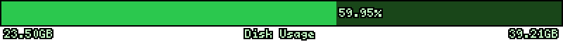

# PHP Usage stats
Simple PHP scripts to generate cute dynamic bar graph images to show the disk and memory usage of a server.

Requires the PHP GD extension to generate the images on the fly. Also probably only works on Linux.

## Example

